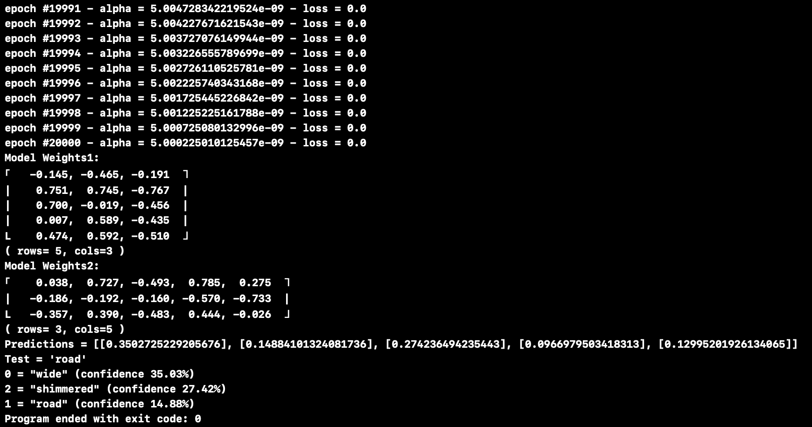

# Word2vec

Quick hobby project to learn more about AI concepts. It implements a very basic matrix math, neural net, one hot encoder and word2vec in pure swift and is not accelerated in any way.

I'm sure there are plenty of bugs and incorrectly implemented details here but does represent the overall structure of the algorithm. Feel free to reach out/fork with questions or corrections.

